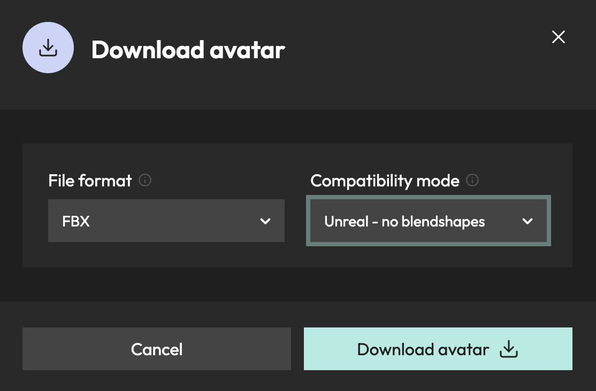

# Meshcapade Unreal Plugin (UE 5.4)

For a better viewing experience, visit our <a href='https://me.meshcapade.com/integrations/unreal'>webpage</a>.

This plugin allows you to quickly retarget motions created on the [Meshcapade.me](https://me.meshcapade.com/) platform onto your own characters in [Unreal Engine 5](https://www.unrealengine.com/en-US/download). Bodies created on the Meshcapade platform are created using the [SMPL](https://smpl.is.tue.mpg.de/) core technology, and are thus referred to as [SMPL-bodies](https://smpl.is.tue.mpg.de/license.html).  

📝 This version of the plugin has only been tested on Unreal Engine version 5.4.  It may or may not work on earlier or later versions.

I. Adding the plugin to your Unreal project

[Download](https://github.com/Meshcapade/mc-unreal/releases/latest/download/mc-unreal.zip) the Unreal Plugin directly, or grab from our [git repo](https://github.com/Meshcapade/mc-unreal).

📝 Make sure that your Unreal project is closed before proceeding.  

Once you have the plugin downloaded, unzip the plugin and put the `Plugins` folder into the top level of your Unreal project.

 

📝 For MacOS users, install [Xcode](https://apps.apple.com/us/app/xcode/id497799835?mt=12) before relaunching.  When opening your Unreal project for the first time after adding the plugin, a warning will pop up asking you to rebuild missing modules.  Click `Yes` and continue normally.

📝 For Windows and Ubuntu users, there's nothing extra to do.

II. Getting an animation from <a href='https://me.meshcapade.com' target='_blank'>Meshcapade.me</a>

Currently, there are two ways to get animations from [Meshcapade.me](https://me.meshcapade.com/):
- [Motion from video](https://me.meshcapade.com/from-videos) - extract the human motion from a video.

- [Motion from text](https://me.meshcapade.com/editor) - find a human motion in our library of thousands of motions.

### A. [Motion from video](https://me.meshcapade.com/from-videos)
To get an animation from a video, visit the Meshcapade [motion from video](https://me.meshcapade.com/from-videos) page.  Follow the prompts until you've created an animated avatar.

### B. [Motion from text](https://me.meshcapade.com/editor)
To search for a motion from our motion library, visit the Meshcapade [editor](https://me.meshcapade.com/editor) page. On the top right, there is a search box where you can find animation.  Once you've found the animation you want, save the avatar into your vault.

 

III. Downloading the animation 

Go to your [avatar vault](https://me.meshcapade.com/vault) and open the avatar in editor (which contains the motion you'd like to download). Once the avatar is open in the editor, click the Download button located at the top left corner of the page. Download options will then appear. If you're only interested in downloading the motion–which will make the import process faster, make sure that `file format` is set to `.FBX` (`.OBJ` has no motion).  and `compatibility mode` is set to `Unreal - no blend shapes`. If you want to use [Pose Correctives](#pose-correctives), then make sure `compatibility mode` is set to `Unreal`. Click Download avatar.

IV. Importing the .FBX into Unreal

With the .FBX downloaded, import it into your unreal project (File > Import).

Set the skeleton to `SK_MeshcapadeBody`.  If you don't see it, then click the gear next to the search box and make sure `Show Plugin Content` is checked.  In the content browser, `SK_MeshcapadeBody` is located here: `Content/Plugins/Meshcapade/Meshes/SK_MeshcapadeBody`.

📝 Make sure that `Import Animation` is checked.

📝 If you’re interested in the [Pose Correctives](#pose-correctives), you also need to use the check `Import Morph Targets`.

📝 If you are importing a single frame .FBX, for example if you [created a SMPL-body from an image](https://me.meshcapade.com/from-photos), also check `Use T0 As Ref Pose`.

V. Retargeting the animation

One thing you may want to do is retarget the motion from the SMPL-body onto the body of your character.  

### A. Auto Retargeting

As of 5.4, this process has been massively simplified.  Just find your animation, right click on it, and choose `Retarget Animations`.

Assign the character to which you'd like to transfer the animation to the `Target Skeletal Mesh`.  Choose the animation(s) you want to retarget, and then click `Export Animations`.

If the animation looks the way you want it to, then you can skip to [editing the animation](#editing)

### B. Editing the Retargeter

If the animation isn't exactly the way you'd like it, you can adjust the retargeter.  By default `Auto Generate Retargeter` is checked.  We can mofidy the retargeting assets to make them exactly what we want them to be.

In the `Retarget Animations` menu, choose `Export Retarget Assets` 

Open the newly generated retargeting asset.

To adjust the retargeter, click the 3 dots next to `Running Retarget`, and select `Edit Retarget Pose`.

You can see that on the automatic retargeter the spine and one of the arms need to be fixed.  Select the bone you want to fix, press `e` to enter rotation mode, and then manually correct the rotation.  

Right click on your animation again, and choose `Retarget Animations`.  But this time, uncheck `Auto Generate Retargeter` and set the retargeter to the one you corrected.  Repeat the process of editing the retargeter and testing it until it's the way you want it.  The exact issues you face with the automatically generated retargeter will vary depending on your specific character. 

Here's an example of the retargeted animation on a custom character next to the original animation.

VI. Editing the animation

If the animation doesn't look right on your character, there are two options:  
1. The first is to go back to the platform and try to get something more suitable.  You can go to the [motion from video](https://me.meshcapade.com/from-videos) page and upload a different video to get different results, or you can go to the [motion from text](https://me.meshcapade.com/editor) section of the editor and try to search for a more suitable animation using a different prompt.
2. The second thing you can do is edit the animation after the fact, and there are several ways to do this.  An easy way to do this which also gives you lots of control, is to use a control rig that has a forward and backward solver.

The control rig that comes with the third-person template, which we also ship with the plugin, is sufficient for this.  In the content browser, go to `Plugins` > `Meshcapade Content` > `Rigs` and duplicate the `CR_Mannequin_Body` rig.

You will have to make edits to this control rig depending on how different your character's skeleton is from the Unreal conventional skeleton.

In the `Preview Scene Settings`, change the preview mesh to that of your character.

If you are retargeting a UE4 character, for example, you would need to make a few changes to the skeleton.  In the Rig Hierarchy, you can rearrange bones by clicking and dragging them.  The spine, neck, and hands are in different places in the UE4 and UE5 conventional skeletons.  You would need to make the following changes:
- Move `clavicle_l`, `clavicle_r` and `neck_01` to be underneath `spine_03`
- Move `head` to be underneath `neck_01`
- On both hands, move `index_01`, `middle_01`, `ring_01`, and `pinky_01` to be direct children of their corresponding `hand` bones.

For more information on this subject, see the Unreal documentation on [Control Rig](https://docs.unrealengine.com/5.4/en-US/control-rig-in-unreal-engine/).

Once you have a control rig that works with your character, you can bake the animation onto that control rig.  Make a new level sequence by right-clicking and typing `level sequence` or going to `Cinematics` > `Level Sequence`.  Drag the animation asset into your level, select it, and then in the sequencer select `+Track` > `Actor To Sequencer` > `<your animation asset>`.

Click the `+` to the right of `Animation` and add your animation asset.

Right-click on the top node of your animation in the track panel and choose `Bake to Control Rig` > `<your control rig>`.  Click `Create`.

Note: the animation will only bake what's between the red and green markers on the timeline.  If you want to trim the animation, you can do it by moving the markers.

Select the new control rig layer on the track, right-click, and choose `Add Section` > `Additive`.  This will allow you to add an animation on top of the existing animation.

At this point, you can spend as little or as much time as you'd like to make the animation do what you want to do. In the example below, I tweak the height of the global control so that the character doesn't clip the ground as much as he bends forward.  You could then fix the hands and fingers or, cartoony motion, etc.

Once you're happy with your animation, the last step is to bake it.  Right-click on the top node in the track panel, choose `Bake Animation Sequence`, and save it.  Now your edited animation can be used as normal.

VII. Using Pose correctives

Pose correctives allow for real-time calculation of pose-based deformations to SMPL-bodies.  They are a complex set of blend shapes that we apply based on the pose of the skeleton.  This achieves much more realistic soft tissue deformation than the traditional skinning method.  They are also extremely easy to apply to actor blueprints.

 

_In the example above, the body on the left shows the motion with the pose correctives applied,  and the body on the right shows the pose correctives without the motion._

📝 To be able to use pose correctives, make sure you enable `Import Morph Targets` in the [import step](#importing) when you import a SMPL-body.

To enable pose correctives on blueprint actor, add a skeletal mesh component that contains a SMPL-body, then add the `Pose Correctives` actor component to the same blueprint.

The example below has two bodies overlapping to illustrate the result further.  The orange body doesn't have pose correctives, the textured body does.

We welcome your feedback on this, or any of our other products.  For comments, questions or feedback, please [contact us](https://meshcapade.com/contact).
