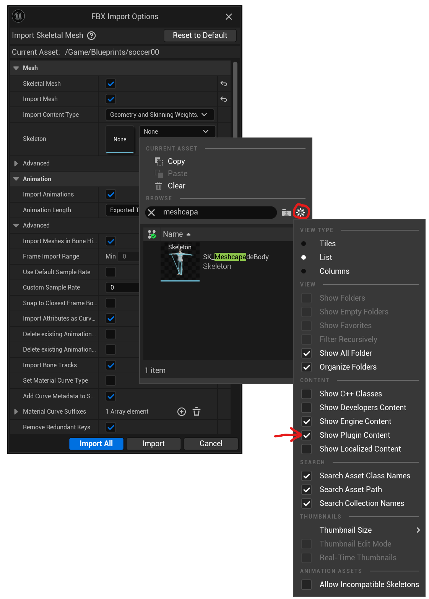
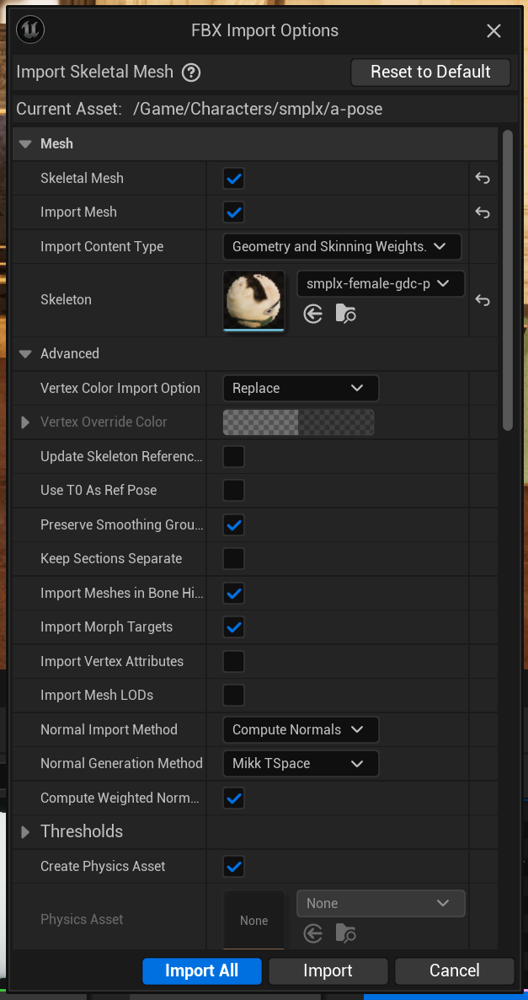

# Meshcapade Unreal Suite

## I. download the unreal plugin and add it to your unreal project

link to plugin location on our web page

download the plugin, unzip it (it will have /Plugin/ as the top folder), and then drop the contents into your unreal project.  Launch unreal, make sure it’s there. 

## II. Download an animated fbx from Meshcapade.me

Currently, there are two ways to get animations from [Meshcapade.me](https://meshcapade.me/): [afv](https://me.meshcapade.com/from-videos) (what are we calling this externally) and [tmr](https://me.meshcapade.com/editor) (what are we calling this externally).

### A. afv
To get an animation from video, visit 
https://me.meshcapade.com/from-videos.  Follow the prompts until you've created an animated avatar.

### B. tmr
To search for a motion from our motion library, visit https://me.meshcapade.com/editor. In the top right, there is a search box where you can search for an animation.  Once you've found the animation you want, save the avatar into your vault.

## III. download the fbx

Go to your [avatar vault](https://me.meshcapade.com/vault), and click the `...` on the top right corner of the avatar containing the motion you'd like to download.  In the download options, make sure that `file format` is `fbx` (`obj` has no motion) and `Pose/Motion` is `Captured Motion`.  For `compatibility mode`, select `Unreal` if you are interested in using the Meshcapade body with pose correctives.  Choose `Unreal - no blenshapes` if you're only insterested in the motion, this will make the import process faster.  

## IV. Import the fbx into Unreal

With the fbx downloaded, import it into your unreal project (File > Import).  

Set the skeleton to `SK_MeshcapadeBody`.  If you don't see it, then click the gear next to the search box and make sure `Show Plugin Content` is checked.  

In the content browser, `SK_MeshcapadeBody` is located here: `Content/Plugins/Meshcapade/Meshes/SK_MeshcapadeBody` 

If you’re interested in using the Meshcapade Body outright and you want pose correctives, check "import morph targets"

Make sure and check "import animation"

## V. retargeting animation

once the fbx is in unreal, if you’re interested in just the animation, you can delete the rest of the fbx files.  If you want to use the meshcapade body, you can use it right away.

To retarget, you need two IK rigs, one for the meshcapade body which comes with the plugin, and one for your character.  To make an IK rig for your character is very easy, this is how I would do it:

….

Then, once you make the IK rig, you make the retargeter.  I’d do it like this: …

Once you have the retargeter, then right click on the animation you imported, and retarget it with the retargeter you just made

## VI. Editing animation

make a fwd and backward control rig by editing the UE manniquen one:

now make a sequence

add the animation

bake it to control rig

edit it

export the animation

## VII.  Using Meshcapade Bodies

One benefit to using meshcapade bodies is that meshcapade bodies can also have pose based correctives applied to them.  This is a
