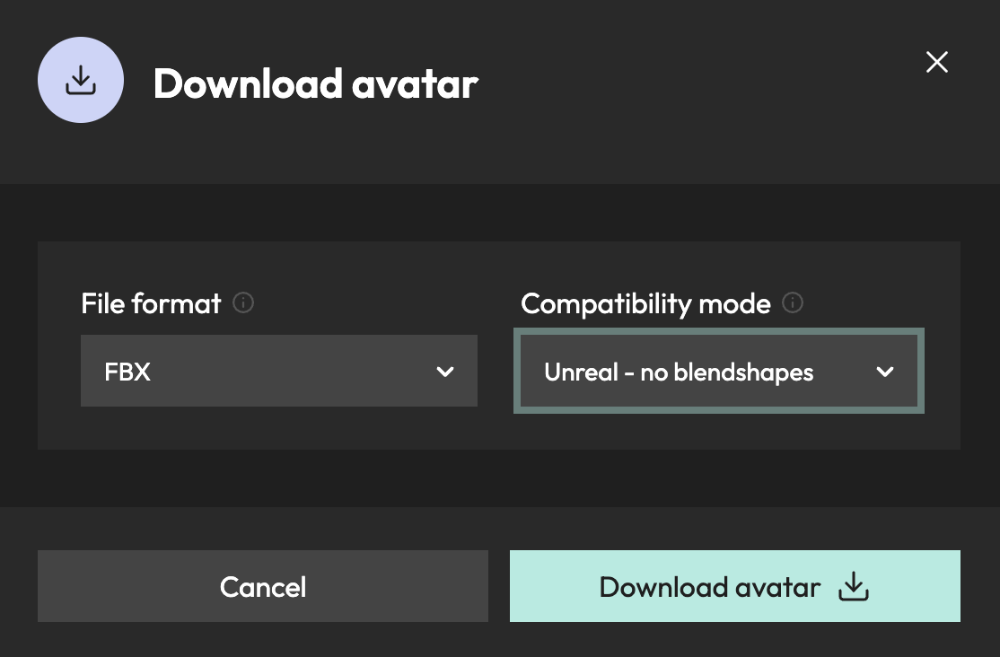
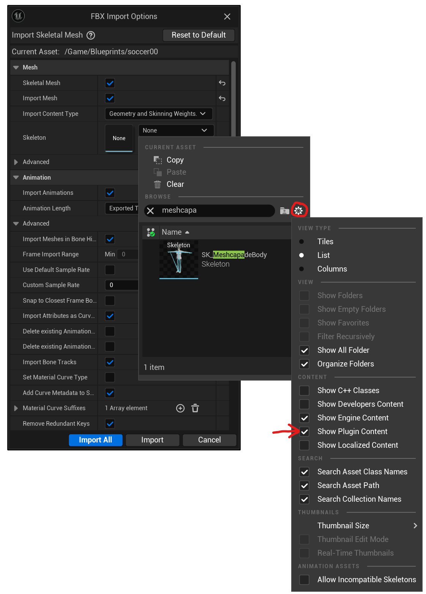

# Meshcapade Unreal Plugin (5.4)

### Plugin Releases

| Unreal Version | Plugin Version | Download Release                                                                             |
|:--------------:|:--------------:|:--------------------------------------------------------------------------------------------:|
| v5.3           | v5.3.2.2       | [Download](https://github.com/Meshcapade/mc-Unreal/releases/download/v5.3.2.2/mc-unreal.zip) |
| v5.4           | v5.4.4.2       | [Download](https://github.com/Meshcapade/mc-Unreal/releases/download/v5.4.4.2/mc-unreal.zip) |

For a better viewing experience, visit our <a href='https://me.meshcapade.com/integrations/Unreal'>webpage</a>.

This plugin allows you to access motions created on the [Meshcapade.me](https://me.meshcapade.com/) platform and quickly retarget them onto your own characters in [Unreal Engine 5](https://www.Unrealengine.com/en-US/download). Bodies created on the Meshcapade platform use [SMPL](https://smpl.is.tue.mpg.de/) core technology and are referred to as [SMPL-bodies](https://smpl.is.tue.mpg.de/license.html).  

📝 This guide is for Unreal Engine version 5.4. It may or may not work with earlier or later versions. We’ve developed specific plugins and READMEs for the versions listed in the table above.

I. Adding the plugin to your Unreal project

[Download](https://github.com/Meshcapade/mc-Unreal/releases/latest/download/mc-Unreal.zip) our latest Unreal plugin version directly, or grab it from the release table above.

📝 Make sure your Unreal project is closed before proceeding.

Once you've downloaded the plugin, unzip it and place the `Plugins` folder at the top level of your Unreal project.

 

📝 Binaries for MacOS, Windows, and Ubuntu are provided.

II. Creating an animation on <a href='https://me.meshcapade.com' target='_blank'>Meshcapade.me</a>

Currently, there are two ways to create animations on [Meshcapade.me](https://me.meshcapade.com/):
- [Motion from video](https://me.meshcapade.com/from-videos): Extract human motion from a video.
- [Motion from text](https://me.meshcapade.com/editor): Browse and search our library of thousands of motions.

### A. [Motion from video](https://me.meshcapade.com/from-videos)
To create an animation from a video, visit the Meshcapade [motion from video](https://me.meshcapade.com/from-videos) page. Follow the prompts until you've created an animated avatar.

### B. [Motion from text](https://me.meshcapade.com/editor)
You can also search our motion library on the Meshcapade [editor](https://me.meshcapade.com/editor) page. Use the search box in the top-right corner to find animations. Once you’ve found one, save the avatar to your vault.

 

III. Importing animations from within Unreal

The Meshcapade plugin enables you to search your avatar vault and import multiple avatars at once directly into Unreal Engine.

To get started, ensure the plugin is enabled by navigating to `Edit` > `Plugins`, searching for `Meshcapade`, and confirming that it is enabled.

📝 If prompted to restart Unreal, do so before proceeding.

Click the Meshcapade logo in the top toolbar to launch the Meshcapade Vault UI.

Click `Sign In`.

Your browser will open, prompting you to login to the platform. Follow the instructions to complete the sign in process.

If the browser does not open automatically or the login fails, copy the provided URL and paste it into your web browser to manually login.

Once signed in, you'll see a list of your available avatars. Select the checkbox next to the avatar you want to import.

You can search for assets by name or creation date using standard Unreal search conventions.

📝 This list only includes avatars that have animations. If your avatar does not have animation, refer to Section III for that download process.

Click `Import` to bring the selected avatars into your project's Content folder.

The source files will be downloaded to the `/<project>/MeshcapadeCache/` directory.

📝 After clicking import, you will see a popup that says `Preparing GLBs...`.  There is a one time operation that requires the avatar's corresponding GLB to be generated on the platform.  Subsequent downloads of the same `.GLB` will be much faster.  The `.GLB` is also downloaded to the `/<project>/MeshcapadeCache/` folder during this phase of the import.  

Imported assets will be automatically imported into the `/<project>/Content/MeshcapadeVault/` folder. Each imported avatar will be placed in its own subfolder containing all assets generated from it during the import.

Once you’ve completed the steps above, proceed directly to section V.

IV a. Downloading animations from the platform

Go to your [avatar vault](https://me.meshcapade.com/vault) and open the avatar in the editor (the one that contains the motion you'd like to download). Once it’s open, click the `Download` button in the top-left corner. 

To download just the motion—which speeds up the import—make sure:
- `File format` is set to `.GLB` or `.FBX` (`.OBJ` does not contain motion),
- `Compatibility mode` is set to `Unreal - no blend shapes`.

If you want to use [Pose Correctives](#pose-correctives), set `Compatibility mode` to `Unreal`. We always export `.GLB` files with [Pose Correctives](#pose-correctives). The camera is only available in `.GLB` format.

IV b. Importing the .GLB into Unreal

You can import `.GLB` files into your project using either Scene Import (`File` > `Import into Level`) or Asset Import (`Content Drawer` > `Import`).

📝 To import the animated camera, use Scene Import.

For the sake of retargeting, set the skeleton to `SK_Meshcapade_glb`. If it doesn't appear, click the gear icon next to the search box and enable `Show Plugin Content`. The skeleton is located at: `Content/Plugins/Meshcapade/Meshes/SK_Meshcapade_glb`.

IV c. Importing the .FBX into Unreal

📝 We generally recommend using `.GLB` with the corresponding retargeter, as we may deprecate `.FBX` in future releases.

To import a `.FBX`, use `Content Drawer` > `Import`.

For the sake of retargeting, set the skeleton to `SK_Meshcapade_fbx`. If it's not visible, click the gear icon and enable `Show Plugin Content`. The skeleton is located at: `Content/Plugins/Meshcapade/Meshes/SK_Meshcapade_fbx`.

📝 Ensure `Import Animation` is checked.

📝 If using [Pose Correctives](#pose-correctives), check `Import Morph Targets`.

📝 For single-frame `.FBX` files (e.g. from a [photo-based SMPL-body](https://me.meshcapade.com/from-photos)), also check `Use T0 As Ref Pose`.

V. Retargeting the animation

The process of transferring animation from one character to another is called retargeting. 

One thing you may want to do is retarget the motion from the SMPL-body onto the body of your character.  

### A. Auto Retargeting

As of 5.4, this process has been massively simplified.  Just find your animation, right click on it, and choose `Retarget Animations`.

Assign the character to which you'd like to transfer the animation to the `Target Skeletal Mesh`.  Choose the animation(s) you want to retarget, and then click `Export Animations`.

If the animation looks the way you want it to, then you can skip to [editing the animation](#editing)

### B. Editing the Retargeter

If the animation isn't exactly the way you'd like it, you can adjust the retargeter.  By default `Auto Generate Retargeter` is checked.  We can mofidy the retargeting assets to make them exactly what we want them to be.

In the `Retarget Animations` menu, choose `Export Retarget Assets` 

Open the newly generated retargeting asset.

To adjust the retargeter, click the 3 dots next to `Running Retarget`, and select `Edit Retarget Pose`.

You can see that on the automatic retargeter the spine and one of the arms need to be fixed.  Select the bone you want to fix, press `e` to enter rotation mode, and then manually correct the rotation.  

Right click on your animation again, and choose `Retarget Animations`.  But this time, uncheck `Auto Generate Retargeter` and set the retargeter to the one you corrected.  Repeat the process of editing the retargeter and testing it until it's the way you want it.  The exact issues you face with the automatically generated retargeter will vary depending on your specific character. 

Here's an example of the retargeted animation on a custom character next to the original animation.

VI. Editing the animation

If your animation doesn't look right, you have two main options:
1. Return to the platform and try different inputs (new video, new search term).
2. Edit the animation using a control rig with forward and backward solving.

The third-person template control rig (also shipped with this plugin) is a good starting point. Duplicate `CR_Mannequin_Body` in `Plugins > Meshcapade Content > Rigs`.

Adjust the control rig for your skeleton if needed. In `Preview Scene Settings`, set the preview mesh.

For UE4 characters:
- Move `clavicle_l`, `clavicle_r`, and `neck_01` under `spine_03`
- Move `head` under `neck_01`
- On both hands, move all fingers directly under the `hand` bones.

For more information on this subject, see the Unreal documentation on [Control Rig](https://docs.unrealengine.com/5.4/en-US/control-rig-in-unreal-engine/).

Once you have a control rig that works with your character, you can bake the animation onto that control rig.  Make a new level sequence by right-clicking and typing `level sequence` or going to `Cinematics` > `Level Sequence`.  Drag the animation asset into your level, select it, and then in the sequencer select `+Track` > `Actor To Sequencer` > `<your animation asset>`.

Click the `+` to the right of `Animation` and add your animation asset.

Right-click on the top node of your animation in the track panel and choose `Bake to Control Rig` > `<your control rig>`.  Click `Create`.

Note: the animation will only bake what's between the red and green markers on the timeline.  If you want to trim the animation, you can do it by moving the markers.

To apply additive tweaks, right-click the control rig track and choose `Add Section > Additive`.

Make edits as needed (e.g., adjust height to avoid ground clipping).

Once satisfied, right-click and choose `Bake Animation Sequence` to save your new asset.

VII. Using Pose correctives

Pose correctives allow for real-time pose-based deformation of SMPL-bodies using blend shapes, resulting in much more realistic soft tissue motion than traditional skinning.

 

_In the example above, the body on the left shows motion with pose correctives applied. The body on the right does not._

📝 To use pose correctives, ensure `Import Morph Targets` is enabled during [GLB import](#importing_glb).

To enable pose correctives in a Blueprint:
- Add a skeletal mesh component with a SMPL-body.
- Add the `Pose Correctives` actor component to the same blueprint.

The example below shows an orange body (no correctives) and a textured body (with correctives).

For any questions, please [contact us](https://meshcapade.com/contact).
